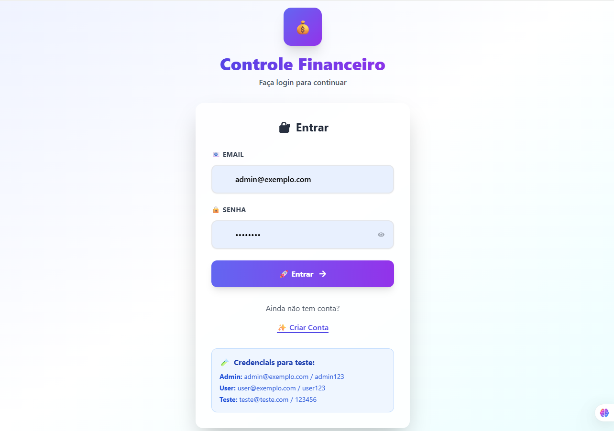

# 💰 Meu Controle Financeiro##

Gerencie suas finanças com estilo, simplicidade e poder!
Aplicação moderna para controle financeiro pessoal com autenticação, modo offline, relatórios dinâmicos e design responsivo no estilo SaaS Dashboard.

## ✅ Funcionalidades Principais
✔ Autenticação segura (Login/Logout)
✔ Adicionar, editar e excluir lançamentos financeiros
✔ Gerenciar pessoas vinculadas aos lançamentos
✔ Resumo por pessoa com cálculo de receitas e despesas
✔ Filtros por mês e ano
✔ Modo Offline com sincronização automática
✔ Interface Responsiva (Desktop & Mobile)
✔ UI moderna com gradientes, sombras e animações

## 🖥 Pré-visualização
(Adicione aqui as screenshots do seu projeto depois do deploy no GitHub Pages ou Vercel)

## 🛠 Tecnologias Utilizadas
### Frontend
Next.js 14+ – Framework React com renderização híbrida

React 18+ – Hooks, Context API e componentização

TailwindCSS – Estilização responsiva e moderna

TypeScript – Segurança e escalabilidade

React Icons – Ícones leves e elegantes

### Backend
Node.js + TypeScript

Express (ou similar)

JSON Database simples com persistência em arquivo

Outros
ESLint + Prettier – Padrões de código

dotenv – Gerenciamento de variáveis de ambiente

# 📂 Estrutura do Projeto

📦 meu-controle-financeiro
 ┣ 📂 backend
 ┃ ┣ 📂 data        # Base de dados JSON
 ┃ ┣ 📂 src
 ┃ ┃ ┣ 📂 database  # Configuração do banco
 ┃ ┃ ┣ 📂 middleware# Autenticação
 ┃ ┃ ┣ 📂 routes    # Endpoints da API
 ┃ ┃ ┣ 📂 types     # Tipos TypeScript
 ┃ ┃ ┣ server.ts    # Inicialização do servidor
 ┣ 📂 src
 ┃ ┣ 📂 app
 ┃ ┃ ┣ 📂 components # Componentes React
 ┃ ┃ ┣ page.tsx      # Página principal
 ┃ ┃ ┣ layout.tsx    # Layout global
 ┃ ┣ 📂 contexts     # Context API (Auth)
 ┃ ┣ 📂 services     # Consumo de API
 ┃ ┣ 📂 types        # Tipos TypeScript
 ┃ ┣ 📂 utils        # Funções utilitárias
 ┣ tailwind.config.js
 ┣ package.json
 ┗ README.md
# 🚀 Como Rodar o Projeto

## Pré-requisitos
Node.js >=18

npm ou yarn instalado

## Instalação

### Clonar o repositório
git clone https://github.com/fclaudio051/meu-controle-financeiro.git

### Entrar na pasta do projeto
cd meu-controle-financeiro

### Instalar dependências
npm install

## Rodar Backend
cd backend
npm install
npm run dev

## Rodar Frontend
npm run dev

# 🌍 Deploy
Frontend: Vercel

Backend: Pode ser hospedado no Render ou Railway

# 📸 Screenshots
 
 
 
 

# 📌 Diferenciais
✔ UI Clean e Moderna inspirada em dashboards SaaS
✔ Sincronização Offline para redes instáveis
✔ Arquitetura escalável separando Frontend e Backend
✔ TypeScript em todo o projeto

# 👨‍💻 Autor
Feito por Cláudio Faustino

