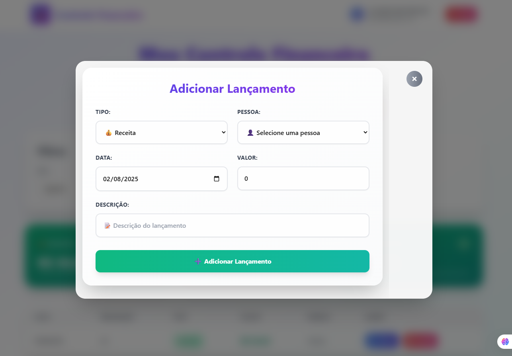

# 💰 Controle Financeiro

Um sistema completo de controle financeiro pessoal desenvolvido com **Next.js** (frontend) e **Node.js + TypeScript** (backend), oferecendo uma experiência moderna e responsiva para gerenciar suas finanças.

## 🚀 Funcionalidades

### ✨ Frontend (Next.js)

- 🎨 **Interface moderna** com design responsivo
- 🔐 **Sistema de autenticação** completo (login/registro)
- 💾 **Modo offline** com sincronização automática
- 📊 **Dashboard financeiro** com resumos visuais
- 👥 **Gerenciamento de pessoas** vinculadas aos lançamentos
- 💰 **Controle de entradas** (receitas, despesas fixas e variáveis)
- 📱 **Totalmente responsivo** para mobile e desktop
- 🌐 **Indicador de conectividade** em tempo real

### 🛠️ Backend (Node.js + TypeScript)

- 🔒 **API RESTful** com autenticação JWT
- 📁 **Banco de dados JSON** para armazenamento simples
- 👤 **Gestão de usuários** com senhas criptografadas
- 💼 **CRUD completo** para pessoas e lançamentos financeiros
- 🔄 **Middleware de autenticação** para rotas protegidas
- 📝 **Sistema de logs** para monitoramento
- 🌍 **CORS configurado** para integração com frontend

### 📸 Screenshots





## 📋 Pré-requisitos

- **Node.js** 18+
- **npm** ou **yarn**
- **Navegador moderno** (Chrome, Firefox, Safari, Edge)

## 🛠️ Instalação e Configuração

### 1️⃣ Clone o Repositório

```bash
git clone <url-do-repositorio>
cd meu-controle-financeiro
```

### 2️⃣ Configuração do Backend

```bash
# Navegue para a pasta do backend
cd backend

# Instale as dependências
npm install

# Configure as variáveis de ambiente
# Crie o arquivo .env na pasta backend/
```

**Arquivo `.env` (backend):**

```env
JWT_SECRET=seu_jwt_secret_muito_seguro_123456789
PORT=3001
CORS_ORIGIN=http://localhost:3000
NODE_ENV=development
```

```bash
# Inicie o servidor backend
npm run dev
```

O backend estará disponível em: `http://localhost:3001`

### 3️⃣ Configuração do Frontend

```bash
# Em um novo terminal, navegue para a pasta do frontend
cd frontend

# Instale as dependências
npm install

# Configure as variáveis de ambiente
# Crie o arquivo .env.local na pasta frontend/
```

**Arquivo `.env.local` (frontend):**

```env
NEXT_PUBLIC_API_URL=http://localhost:3001
```

```bash
# Inicie o frontend
npm run dev
```

O frontend estará disponível em: `http://localhost:3000`

## 📁 Estrutura do Projeto

```
meu-controle-financeiro/
├── backend/                          # Servidor Node.js + TypeScript
│   ├── data/
│   │   └── database.json            # Banco de dados JSON
│   ├── src/
│   │   ├── database/
│   │   │   └── index.ts             # Operações do banco de dados
│   │   ├── middleware/
│   │   │   └── auth.ts              # Middleware de autenticação
│   │   ├── routes/
│   │   │   ├── auth.ts              # Rotas de autenticação
│   │   │   ├── people.ts            # Rotas de pessoas
│   │   │   └── entries.ts           # Rotas de lançamentos
│   │   ├── types/
│   │   │   └── index.ts             # Tipos TypeScript
│   │   ├── server.ts                # Servidor principal
│   │   └── server-simple.ts         # Servidor simplificado
│   ├── package.json
│   └── tsconfig.json
├── frontend/                         # Aplicação Next.js
│   ├── src/
│   │   └── app/
│   │       ├── components/          # Componentes React
│   │       │   ├── AuthGuard.tsx
│   │       │   ├── ConnectivityIndicator.tsx
│   │       │   ├── EntryForm.tsx
│   │       │   ├── EntryTable.tsx
│   │       │   ├── Header.tsx
│   │       │   ├── Login.tsx
│   │       │   ├── Modal.tsx
│   │       │   ├── PersonManagerWithAPI.tsx
│   │       │   └── Summary.tsx
│   │       ├── contexts/
│   │       │   └── AuthContext.tsx  # Context de autenticação
│   │       ├── services/
│   │       │   └── api.ts           # Cliente API
│   │       ├── types/               # Tipos TypeScript
│   │       ├── globals.css          # Estilos globais
│   │       └── page.tsx             # Página principal
│   ├── package.json
│   └── next.config.js
└── README.md
```

## 🔧 Scripts Disponíveis

### Backend

```bash
npm run dev          # Inicia servidor em modo desenvolvimento
npm run dev-simple   # Inicia servidor simplificado
npm run build        # Compila TypeScript
npm run start        # Inicia servidor de produção
```

### Frontend

```bash
npm run dev          # Inicia em modo desenvolvimento
npm run build        # Build para produção
npm run start        # Inicia servidor de produção
npm run lint         # Executa linter
```

## 📡 API Endpoints

### 🔐 Autenticação

| Método | Endpoint         | Descrição                                |
| ------ | ---------------- | ---------------------------------------- |
| `POST` | `/auth/register` | Registrar novo usuário                   |
| `POST` | `/auth/login`    | Fazer login                              |
| `GET`  | `/auth/me`       | Verificar token e obter dados do usuário |

### 👥 Pessoas

| Método   | Endpoint      | Descrição                 |
| -------- | ------------- | ------------------------- |
| `GET`    | `/people`     | Listar pessoas do usuário |
| `POST`   | `/people`     | Criar nova pessoa         |
| `DELETE` | `/people/:id` | Deletar pessoa            |

### 💰 Lançamentos Financeiros

| Método   | Endpoint       | Descrição                     |
| -------- | -------------- | ----------------------------- |
| `GET`    | `/entries`     | Listar lançamentos do usuário |
| `POST`   | `/entries`     | Criar novo lançamento         |
| `PUT`    | `/entries/:id` | Atualizar lançamento          |
| `DELETE` | `/entries/:id` | Deletar lançamento            |

### 🏥 Health Check

| Método | Endpoint                   | Descrição                    |
| ------ | -------------------------- | ---------------------------- |
| `GET`  | `/health` ou `/api/health` | Verificar status do servidor |

## 🎯 Como Usar

### 1️⃣ Primeiro Acesso

1. Acesse `http://localhost:3000`
2. Crie uma conta ou use as credenciais de teste:
   - **Admin:** `admin@exemplo.com` / `admin123`
   - **User:** `user@exemplo.com` / `user123`
   - **Teste:** `teste@teste.com` / `123456`

### 2️⃣ Cadastrar Pessoas

1. Clique em **"Gerenciar Pessoas"**
2. Adicione as pessoas que farão lançamentos
3. **Importante:** É necessário cadastrar pelo menos uma pessoa antes de criar lançamentos

### 3️⃣ Criar Lançamentos

1. Clique em **"Adicionar Lançamento"**
2. Selecione o tipo:
   - **💰 Receita:** Entradas de dinheiro
   - **🔒 Despesa Fixa:** Gastos recorrentes (pode repetir por vários meses)
   - **📊 Despesa Variável:** Gastos únicos
3. Preencha os dados e salve

### 4️⃣ Visualizar Relatórios

- **Dashboard:** Mostra resumo geral (receitas, despesas, saldo)
- **Tabela:** Lista todos os lançamentos do mês selecionado
- **Resumo por Pessoa:** Relatório detalhado por pessoa
- **Filtros:** Altere mês/ano para visualizar períodos específicos

## 🌐 Modo Offline

O sistema possui **modo offline completo**:

- ✅ Funciona sem conexão com internet
- 💾 Dados salvos no localStorage do navegador
- 🔄 Sincronização automática quando conexão retornar
- 🚨 Indicador visual do status de conectividade

### Credenciais para Modo Offline:

- `admin@exemplo.com` / `admin123`
- `user@exemplo.com` / `user123`
- `teste@teste.com` / `123456`

## 🎨 Tecnologias Utilizadas

### Frontend

- **Next.js 14** - Framework React
- **TypeScript** - Tipagem estática
- **Tailwind CSS** - Estilização
- **React Icons** - Ícones
- **React Context** - Gerenciamento de estado

### Backend

- **Node.js** - Runtime JavaScript
- **Express.js** - Framework web
- **TypeScript** - Tipagem estática
- **JWT** - Autenticação
- **bcryptjs** - Criptografia de senhas
- **CORS** - Controle de origem cruzada
- **UUID** - Geração de IDs únicos

## 🧪 Testes

### Teste Manual do Backend

```bash
# Health check
curl http://localhost:3001/health

# Registro
curl -X POST http://localhost:3001/auth/register \
  -H "Content-Type: application/json" \
  -d '{"name":"Teste","email":"teste@exemplo.com","password":"123456"}'

# Login
curl -X POST http://localhost:3001/auth/login \
  -H "Content-Type: application/json" \
  -d '{"email":"teste@exemplo.com","password":"123456"}'
```

### Fluxo de Teste Completo

1. ✅ Acesso ao frontend (`http://localhost:3000`)
2. ✅ Registro/Login de usuário
3. ✅ Cadastro de pessoas
4. ✅ Criação de lançamentos
5. ✅ Visualização de relatórios
6. ✅ Modo offline (desconecte a internet)
7. ✅ Sincronização (reconecte a internet)

## 🔧 Configurações Avançadas

### Alternar Porta do Backend

No arquivo `.env`:

```env
PORT=3001  # Altere para a porta desejada
```

### Configurar CORS para Produção

No arquivo `.env`:

```env
CORS_ORIGIN=https://seu-dominio.com
```

### Habilitar Logs Detalhados

No arquivo `.env`:

```env
NODE_ENV=development
```

## 🚀 Deploy

### Backend (Heroku, Railway, etc.)

```bash
npm run build
npm start
```

### Frontend (Vercel, Netlify, etc.)

```bash
npm run build
npm run start
```

**Importante:** Configure as variáveis de ambiente no serviço de deploy.

## 🐛 Solução de Problemas

### Servidor não inicia

```bash
# Verifique se a porta está livre
netstat -ano | findstr :3001

# Reinstale dependências
rm -rf node_modules
npm install
```

### Erro de CORS

Verifique se `CORS_ORIGIN` no backend corresponde à URL do frontend.

### Dados não salvam

Verifique se o arquivo `.env` está configurado corretamente e se a pasta `backend/data/` tem permissões de escrita.

### Modo offline não funciona

Certifique-se de que o navegador suporta `localStorage` e não está em modo privado.

## 👨‍💻 Desenvolvedor

Sistema desenvolvido como projeto de estudo em **Node.js**, **TypeScript**, **Next.js** e **React**.
Feito por Cláudio Faustino

## 📄 Licença

Este projeto é de uso educacional e pessoal.

---

## 🎯 Próximas Melhorias

- [ ] Implementação de banco de dados SQL (PostgreSQL/MySQL)
- [ ] Autenticação com OAuth (Google/GitHub)
- [ ] Gráficos e dashboards avançados
- [ ] Exportação de relatórios (PDF/Excel)
- [ ] Categorização de despesas
- [ ] Metas financeiras
- [ ] Notificações push
- [ ] Modo escuro
- [ ] Testes automatizados (Jest/Cypress)
- [ ] PWA (Progressive Web App)

---

**💡 Dica:** Para melhor experiência, use o sistema em tela cheia e teste o modo offline desconectando a internet!
